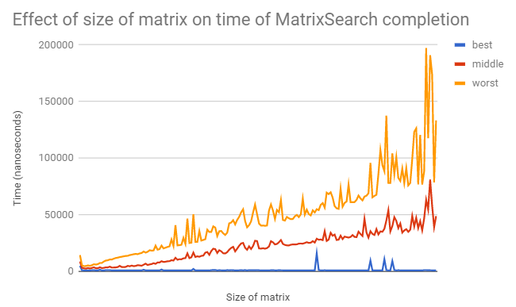

###### Bop It 
###### Brian Lin, Aleksandra Koroza, Isaac Jon  
###### APCS2 pd2
###### L00 -- But What Does the Data Say?
###### 2018-02-08

# Hypothesis
*For an n x n matrix, the worst-case execution time of our search method is O(n)*

# Background 
The Mechanics of our the algorithm: 
1) start in the bottom left corner of the matrix
2) if the value at that index is larger than the target, move up a row 
3) Otherwise, move right across the column
4) Repeat steps 2-3 on whatever element it is currently on, until the target is found, then return the coordinates of the vaule
5) If not, return (-1,-1)

# Experiment methodology
For our experiment, we wanted to test the runtime of our algorithm as the n x n matrix increases in size. 
First, We created two methods, populate and getAverage. Method populate fills a matrix with consecutive integers 
increasing by 1, starting at 1. 

For example, in a 3 x 3 matrix, the elements would be  
| 1 2 3 |  
| 4 5 6 |  
| 7 8 9 |  

Our method get average returned the average time it takes for the search algorithm to find its value in a given matrix. We tested 

1) start with a 1,000 x 1,000 matrix
2) find the average runtime of the best, worst, and middle case for the matrix, inputting it into the csv file. 
3) Repeat step 2 on each matrix with size increasing by 100, up to 10,000. 

# Results

# Conclusion
Based on our results, we can conclude that the algorithm is indeed O(n) runtime for the worst and middle cases. As the size of the 
matrix increases, the resulting line steadily increases at a linear rate for both the worst case and middle case scenarios. 
However, towards the end of the data, the line becomes a bit random, spiking up and back down. Despite the few ocassional spikes,
the line is generally constant. 
